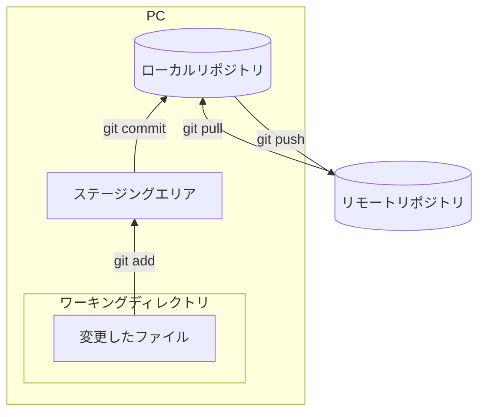

# git-practice

Gitの練習用リポジトリです。Gitの操作と運用方法を学びます。

## 目次
- [はじめに](#はじめに)
- [Git概要](#git概要)
- [Gitの操作](#gitの操作)
    - [基本操作(作業内容をリモートリポジトリに反映させるまで)](#基本操作作業内容をリモートリポジトリに反映させるまで)
    - [実践的な操作](#実践的な操作)
    - [Gitでファイルを管理する上で](#gitでファイルを管理する上で)
- [Gitの運用方法](#gitの運用方法)
    - [ブランチ命名規則](#ブランチ命名規則)
    - [Issueドリブン開発](#issueドリブン開発)
- [参考資料](#参考資料)


## はじめに

以下の項目を学習します。

- **Gitの操作**
    - 作業内容をリモートリポジトリに反映させられる
    - コンフリクトを解消できる
- **Gitの運用方法**
    - 一例として、[Git-flow](https://nvie.com/posts/a-successful-git-branching-model/)と呼ばれる開発戦略を基にした命名規則
    - Issueドリブン開発

なお、Gitがインストールされていることを前提とします。インストールなどの事前準備は[こちら](https://git-scm.com/book/ja/v2)などを参考にしてください。

## Git概要
Gitはバージョンの管理システムで、リポジトリ(貯蔵庫)にファイルを入れて管理を行うというイメージです。

以下のようなイメージでファイルを管理します。
<details>
<summary>イメージ図</summary>



</details>

## Gitの操作
### 基本操作（作業内容をリモートリポジトリに反映させるまで）

<**リポジトリのクローン**>

<details>
<summary>詳細</summary>

`clone`コマンドでリポジトリをクローンすることができます。
```
git clone git@github.com:shin-sui/git-practice.git
```

</details>

<**ブランチの作成と移動**>
<details>
<summary>詳細</summary>

`branch`コマンドでブランチの作成ができます。`[branch_name]`で作成するブランチ名を指定します。
```
git branch [branch_name]
```

引数を渡さずに`branch`コマンドを実行するとブランチの一覧が確認できます。
```
git branch
```
`*`がついているのが現在のブランチです。
```
* main
  sample_branch
```


`switch`コマンドでブランチの移動ができます。`[branch_name]`には移動先のブランチ名を指定します。
```
git switch [branch_name]
```

`switch`コマンドの`-c`オプションを使えば新しいブランチの作成と移動が一度にできます。
```
git switch -c [branch_name]
```

</details>

<**修正した内容の一覧を確認**>

<details>
<summary>詳細</summary>

`status`コマンドで変更のあったファイル一覧が確認できます。
```
git status
```
`modified`は修正したファイルを意味します。以下では、`README.md`が修正されたということがわかります。
```
On branch docs/#1-add-training-menu
Changes not staged for commit:
  (use "git add <file>..." to update what will be committed)
  (use "git restore <file>..." to discard changes in working directory)
        modified:   README.md
```

`modified`の他には、以下のようなものがあります。
- `deleted`: 削除されたファイル
- `Untracked files`: 新規作成したファイル

</details>

<**ファイルのステージング**>

<details>
<summary>詳細</summary>

`add`コマンドで新しく作成したファイルや編集したファイルをステージングできます。`[file_name]`にステージングしたいファイルのパスを指定します。
```
git add [file_name]
```
以下のコマンドはカレントディレクトリ以下のファイルを全てステージングできるため便利ですが強力なコマンドなため使用には注意してください。個人開発ではあまり問題にならないと思いますが、チーム開発ではおすすめしません。チーム開発では、1つのコミットにいくつもの変更が含まれてしまうため、何のコミットかわからなくなってしまいます。
```
git add .
```

</details>

<**コミット**>

<details>
<summary>詳細</summary>

`commit`コマンドでステージングした内容をリポジトリに記録することができます。
```
git commit -m "コミットメッセージ"
```
コミットメッセージは変更内容を簡潔に書くようにしてください。

以下のように引数を渡さずにに`commit`コマンドを打つとデフォルトのテキストエディタが開きます。テキストエディタに慣れていない場合は、戸惑うかもしれません。なので、`-m "コミットメッセージ"`でコマンドラインから直接指定することをおすすめします。
```
git commit
```


</details>

<**プッシュ**>

<details>
<summary>詳細</summary>

`push`コマンドで変更をリモートリポジトリに反映することができます。`[branch_name]`で作業ブランチを指定してください。
```
git push origin [branch_name]
```

`-u`オプションを使うことでプッシュする際にリモートブランチとローカルブランチ追跡関係の設定ができます。これをすることで、次回以降プッシュする際にリモートとローカルブランチ名を省略できます。
```
git push -u origin [branch_name]
```
次回以降、以下でプッシュができます。
```
git push
```
ただし、新しい作業ブランチを作成した場合は再度ブランチ名を入力する必要があります。
```
git switch -c [new_branch_name]
# -> ファイルの編集や追加
git add [file_name]
git commit -m "コミットメッセージ"
git push -u origin [new_branch_name]
```

</details>

### 実践的な操作

<**コンフリクトの解消**>

別々のブランチで同じファイルの同じ箇所を編集していたときにコンフリクトが発生します。gitではブランチをマージ(複数のブランチを1つに統合すること)する際、編集箇所を自動的に統合してくれます。ですが、別のブランチで同じ箇所を編集するとGit側ではどちらを適用すればいいのか判断ができません。そのため手動での解決が必要になります。

これは実際に手を動かしてみた方がいいのでそれぞれのIssueで練習してイメージを掴みましょう。

<details>
<summary>コンフリクト解消までの流れ</summary>

プルリクエストを出すとコンフリクトが発生すると思います。解消までの流れは以下です。

自分の作業ブランチにdevelopをマージします。ブランチのマージは`merge`コマンドでできます。

```
git merge origin/develop
```

すると、以下のようなメッセージが出ると思います。`practice.txt`がコンフリクトしているので修正してコミットする必要があります。
```
Auto-merging practice.txt
CONFLICT (content): Merge conflict in practice.txt
Automatic merge failed; fix conflicts and then commit the result.
```

コンフリクトしているファイルを確認すると、以下のようになっているかと思います。
```
<<<<<<< HEAD
demo (#自分の作業ブランチの変更内容)
=======
conflict (#マージ使用としているブランチの変更内容)
>>>>>>> origin/develop

```

各ブランチの変更内容を確認して、反映したい変更内容を残してください。コンフリクトが解消できたら、コミットをしてプッシュします。一例ですが、コミットメッセージは`"Resolve merge conflict in practice.txt"`のようにするとわかりやすいです。

これでコンフリクトの解消ができます。

</details>

<**ローカルリポジトリを最新の状態にする**>

<details>
<summary>流れ</summary>

リモートリポジトリで自分の作業ブランチが`develop`ブランチにマージされたら、自分のローカルリポジトリの`develop`も同じ状態にしましょう。

方法としては基本的に以下の2パターンです
- `fetch`, `merge`コマンドを使用
- `pull`コマンドを使用

`pull`コマンドは内部的に`fetch`と`merge`を連続して実行するコマンドです。今回は`pull`コマンドを使用してみてください。

`develop`ブランチに移動して、以下のコマンドを実行
```
git pull
```
これでローカルリポジトリをリモートリポジトリと同じ状態にすることができました。ある作業が完了して、次の作業を始めるとき、ローカルリポジトリはリモートリポジトリと同じ状態にしておくことを意識しておいてください。

</details>

### Gitでファイルを管理する上で
Gitでは管理対象のファイルの末尾に改行を含めることが推奨されています。末尾に改行がない場合、GitHubで警告が出ます。この理由をざっくりと説明すると、行が文字と改行までがセットだと定義されているためです。詳しく知りたい人は、「git 末尾　改行 POSIX」などのキーワードで検索してみてください。

## Gitの運用方法

Git運用方法として、ブランチ名の付け方の一例を紹介します。(ただ、**運用ルールはチームによって異なります。実際には、チームの運用ルールに従ってください。**)

ブランチの命名方法を統一することで、チーム開発の効率化につながります。ブランチ名を見ただけで内容がわかるようにすることを念頭に置いておくと良いです。

ここでは、`feature/#10-update-user-profile`のようなブランチ名が読み取れることを目標にします。これは[Issueドリブン開発](#issueドリブン開発)と[ブランチ命名規則](#ブランチの命名規則)のルールに従って命名してあります。以下でそれぞれの説明をします。

### ブランチ命名規則

ブランチの種類ごとに、一般的に以下のように名前が付きます。

| ブランチ種別 | 役割 | 作成元 | マージ先 | 命名規則 | 例 |
|--------------|------|--------|--------|----------|----|
| **`main`** | 本番環境にリリースされている最新の状態を保持するブランチ | - | - | `main` | `main` |
| **`develop`** | 次期リリースに向けた全ての変更が集約される、開発中コードの中心となるブランチ | `main` | - | `develop` | `develop` |
| **`feature`** | 新しい機能の開発や既存機能の改良を行うための一時的なブランチ | `develop` | `develop` | `feature/機能名` | `feature/user-authentication` |
| **`release`** | リリース準備を行い、バグ修正やドキュメント整備などを実施するブランチ | `develop` | `main` および `develop` | `release/バージョン番号` | `release/v1.0.0` |
| **`hotfix`** | 本番環境で発生した重大なバグの緊急修正を行うブランチ | `main` | `main` および `develop` | `hotfix/修正内容` | `hotfix/fix-login-bug` |
| **`bugfix`** | 開発中に見つかったバグの修正を行うブランチ | `develop` | `develop` | `bugfix/バグ内容` | `bugfix/correct-typo` |

`feature/#10-update-user-profile`は、「新しい機能の開発や既存機能の改良を行うための一時的なブランチ」だとわかります。

### Issueドリブン開発

​Issueドリブン開発とは、各作業単位（タスク）を「Issue」として定義し、そのIssueを中心にプロジェクトを進行管理する手法のことです。

#### 一般的な進め方

1. **Issueの作成**：​実装すべき機能や修正すべきバグなど、具体的なタスクをIssueとして記載する
2. **ブランチの作成**：​各Issueに対応するブランチを作成する（ブランチ名にはIssue番号や内容を含めて管理する）
3. **作業**：​作成したブランチ上で作業を行い、適宜コミットする​
4. **プルリクエストの作成**：​作業が完了したら、プルリクエストを作成し、レビュアーにコードレビューを依頼する
5. **マージとIssueのクローズ**：​レビューが承認されたら、ブランチをメインブランチにマージし、対応するIssueをクローズする

#### ブランチに名前をつける

GitHub(やGitLab)でIssueを作成するとIssueごとに`Issue番号`と呼ばれる番号が付きます。このIssue番号と作業内容を作業ブランチにつけます。

`feature/#10-update-user-profile`は「Issue番号10でユーザーのプロフィール情報更新作業のブランチ」だとわかります。

## 参考資料
- https://git-scm.com/book/ja/v2
- https://docs.aws.amazon.com/ja_jp/prescriptive-guidance/latest/choosing-git-branch-approach/branches-in-a-gitflow-strategy.html
- https://zenn.dev/okikusan/articles/e63189a7829418
